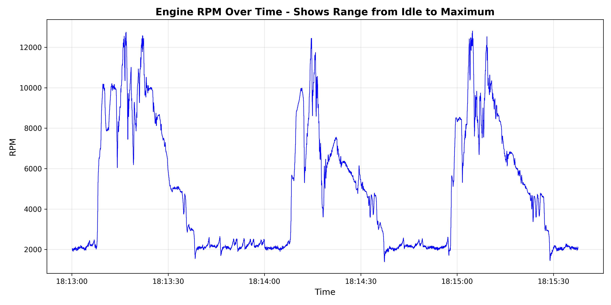
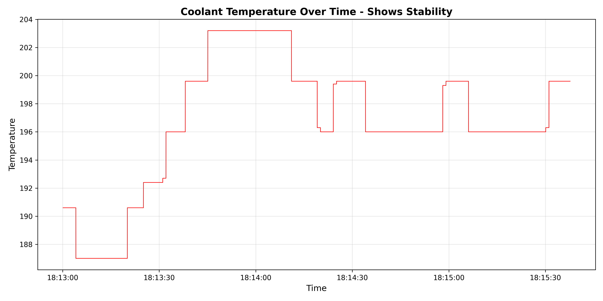
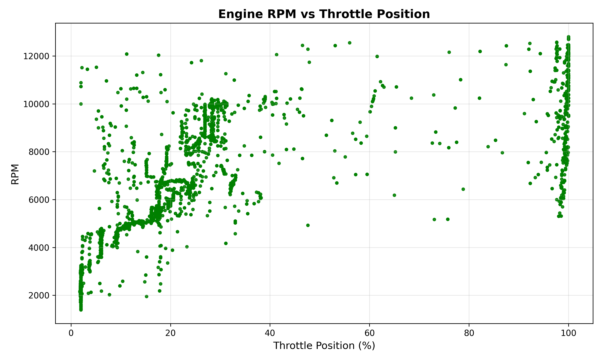
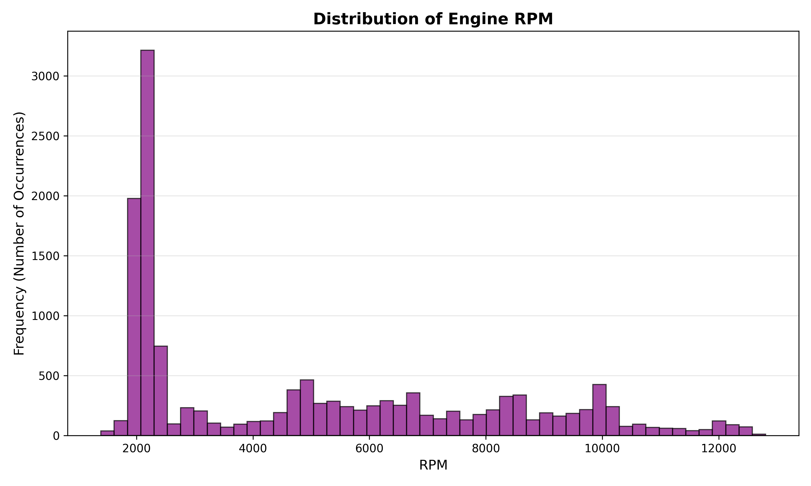
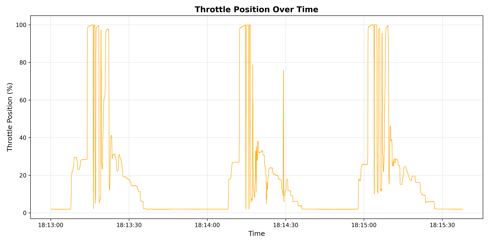

# CAN Bus Data Analysis - Vehicle Performance Study

## Project Overview
This project is my attempt at analyzing data from a high-performance vehicle (racing car??) during a test session.

## Data Source
- **File:** `can_data.csv`
- **Total Rows:** 14,372 data points
- **Recording Duration:** ~2.6 minutes
- **Date:** July 16, 2024

## Data Cleaning Process
When looking through the first few rows, it looks like there are a lot of NaN values as the vehicle gains speed. While this data could be useful, I'm removing it from the DataFrame so other columns could be analyzed with more complete data. There's a lot of data (14k+ rows in csv file), so removing ~40 rows should be negligible.

**Cleaning Steps:**
1. Removed rows with missing data in key engine columns (RPM, TPS, Coolant Temp, MAP, Air Temp, Battery Volt)
2. Converted Unix timestamps to readable datetime format
3. Final dataset: 14,338 rows (34 rows removed)

## Key Findings

### 1. RPM (Engine Speed)
The average RPM was 4979, but the median was 4409. This could mean that while the driver spent more time at lower RPMs, there were high-RPM moments.

**Statistics:**
- Minimum: 1,389 RPM
- Maximum: 12,805 RPM
- Average: 4,979 RPM
- Median: 4,409 RPM

### 2. Throttle Position
The median throttle position was 6.0%, indicating that the driver was not really hitting the gas pedal (cruising) for most of the drive. However, the maximum throttle reached 100.0% at one point, indicating that the driver used full throttle at least once, maybe during a particularly long, clean stretch of road/track or just for occasional acceleration.

**Statistics:**
- Minimum: 1.8%
- Maximum: 100.0%
- Average: 19.3%
- Median: 6.0%

### 3. Coolant Temperature
Coolant temperature didn't vary much, only 16.2 degrees. The low standard deviation, 4.7, indicates stable temperature control.

**Statistics:**
- Minimum: 187.0
- Maximum: 203.2
- Average: 196.7
- Standard Deviation: 4.7

## Visualizations

### Graph 1: Engine RPM Over Time

This graph visualizes the RPM range mentioned in analysis, showing how engine speed varied from idle to maximum throughout the test session.

---

### Graph 2: Coolant Temperature Over Time

This graph visualizes the temperature stability mentioned in analysis, demonstrating consistent cooling system performance despite varying engine loads.

---

### Graph 3: Engine RPM vs Throttle Position

This scatter plot shows the relationship between how far the gas pedal was pressed (throttle) and the resulting engine speed (RPM). Each dot represents one moment in time. The pattern shows that higher throttle positions generally result in higher RPMs, though there's variation due to factors like gear selection and vehicle speed.

---

### Graph 4: Distribution of Engine RPM

This histogram shows how much time was spent at different RPM ranges. The tall bars on the left indicate the driver spent most of the time at lower RPMs (2,000-4,000 range), consistent with cruising behavior. The smaller bars extending to the right show occasional high-RPM usage, confirming the mix of casual driving with brief performance bursts.

---

### Graph 5: Throttle Position Over Time

This graph tracks the gas pedal position throughout the test session. Most of the time, the throttle stays near the bottom (light cruising), but there are several spikes where the driver pushed the pedal down significantly. The spike reaching 100% shows the moment when full throttle was applied.

---

## Conclusions
- The vehicle demonstrated high-performance characteristics with a maximum RPM of 12,805
- Driver behavior showed mostly conservative cruising with occasional full-throttle acceleration
- The cooling system maintained stable temperatures throughout the test, indicating effective thermal management
- All monitored systems (engine, electrical, cooling) functioned within normal parameters

## Tools Used
- **Python 3.x**
- **pandas** - Data manipulation and analysis
- **matplotlib** - Data visualization

## Files in Repository
- `data_analysis.py` - Main analysis script
- `can_data.csv` - Raw data file
- `rpm_over_time.png` - RPM visualization
- `temperature_stability.png` - Temperature visualization
- `rpm_vs_throttle.png` - RPM vs throttle scatter plot
- `rpm_distribution.png` - RPM distribution histogram
- `throttle_over_time.png` - Throttle position visualization
- `README.md` - This file

# Post Submission Updates:
- Last three graphs